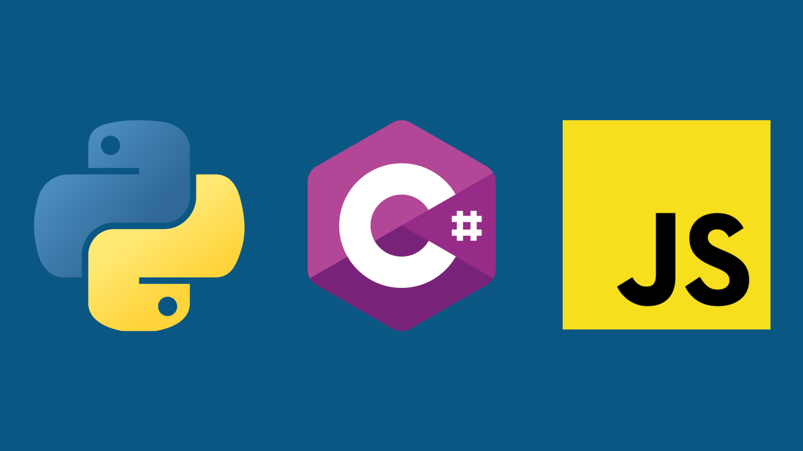

# Repositório de projetos realizados e estudos.

## Projetos até o momento:
- Sistema de cadastro e filtragem
- Estruturas de dados em C
- Operações de Matriz

## Linguagens de programação utilizadas:
- 🐍 <strong>Python</strong>
-  <strong> C</strong>
- <strong> C#</strong>